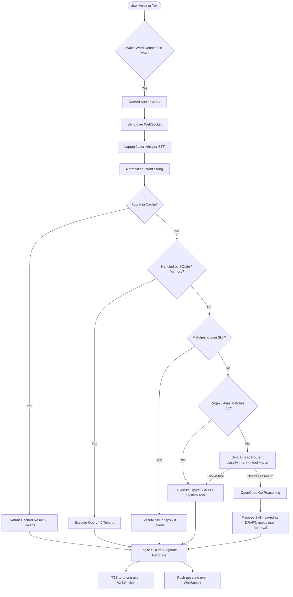
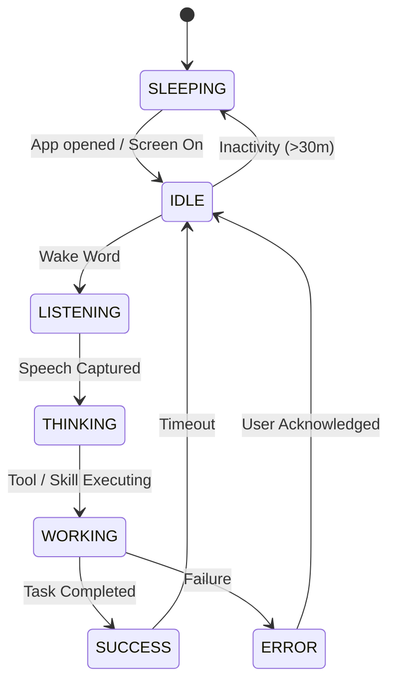

# [DEV] Volchino Personal AI Agent — Master System Architecture & Build Specification (v2)

> **System Vision**: A local-first, privacy-respecting, zero-token-waste personal AI agent. An Arch Linux + Hyprland laptop is the deterministic server core. A Redmi Note 8 Pro runs a Chrome-installed web app (voice interface + living AI Tamagotchi avatar) plus Termux helpers. They talk over a real-time WebSocket via Tailscale. Cloudflare R2 is only an async backup of Obsidian notes.

> [!IMPORTANT]
> **Secrets live only in `.env`** (git-ignored). See `.env.example` for key names. Never paste keys into this doc.

## Changelog v1 → v2
| Change | Reason |
| :--- | :--- |
| Removed "2s R2 real-time sync" | `remotely-save` is interval-based; 2s polling exceeds R2 free Class A ops. R2 is now a 5-min async backup. |
| Real-time = WebSocket (laptop ⇄ phone) over Tailscale | Instant, free, works off home Wi-Fi. |
| SQLite is **never** synced to R2 | Live DB sync corrupts. Only markdown notes + exported JSON snapshots sync. |
| Phone UI = installed web app (PWA) served over Tailscale HTTPS | Mic needs HTTPS. Wake word runs only while the app is open (screen-on "dock mode"). |
| Intent routing adds a cheap Groq/embedding router | Regex/cache alone is brittle for natural speech. |
| FLUX prompt: positive-only | FLUX schnell ignores negative prompts. |
| Laptop runs as `systemd --user` service, sleep disabled on AC | Server must stay reachable. |
| All secrets moved to `.env` | Previously exposed in plain text. |
| Dropped from scope for now: pet hunger/energy decay, 16:9 social pipeline (Phase 8) kept last | Not needed for a working core. |

---

## 1. Core Architectural Philosophy: Intelligence != LLM

1. **The LLM is NOT the whole agent**: it provides reasoning on demand; the deterministic system provides memory, execution and reliability.
2. **Zero-Token Hierarchy**:

   User Request → Cache → SQLite Memory → Known Skill → Deterministic Tool → **Cheap Router (Groq)** → OpenCode Go (only if needed)

3. **No Continuous Model Retraining**: improvement happens via persistent memory, preferences, corrections and learned skills.
4. **Dual Memory Model**:
   - **SQLite**: machine memory (cache, command history, activity, pet stats). Local only.
   - **Obsidian**: human-readable long-term memory (`Daily/`, `Projects/`, `Skills/`, `Memory/`).

---

## 2. Hardware & Network Topology

```
+--------------------------------------+        +------------------------------------+
|  REDMI NOTE 8 PRO (6 GB RAM)         |        |  ARCH LINUX LAPTOP (8 GB RAM)      |
|  Chrome-installed Web App (PWA)      |        |  Main Agent Server Core            |
|  - Tamagotchi avatar UI              |  WSS   |  - FastAPI WebSocket + REST        |
|  - Mic capture (screen-on dock mode) |<======>|  - Hyprland deterministic tools    |
|  - TTS playback                      | Tailsc.|  - SQLite memory & cache           |
|  Termux (optional helpers)           |        |  - faster-whisper STT              |
|  - ADB target, notifications         |        |  - Activity tracker                |
+--------------------------------------+        |  - Groq router / OpenCode client   |
                                                |  - Obsidian vault bridge           |
                                                +----------------+-------------------+
                                                                 | every ~5 min (async)
                                                                 v
                                                +------------------------------------+
                                                |  CLOUDFLARE R2 (obsidian-vault)    |
                                                |  Backup of markdown notes only     |
                                                +------------------------------------+
```

### Network rules
- Laptop and phone both join **Tailscale**. Laptop serves HTTPS via `tailscale serve` / `tailscale cert`, giving a `https://<laptop>.<tailnet>.ts.net` URL.
- Open that URL in Chrome on the phone → **Install app** (PWA). HTTPS is required for `getUserMedia` (mic).
- FastAPI binds to `127.0.0.1`; `tailscale serve` proxies it. No `0.0.0.0` exposure.

### Phone PWA limits (accepted trade-off)
- Mic and wake word work **only while the app is open and the screen is on** (use the Screen Wake Lock API, "dock mode").
- Wake word runs in-browser with **openWakeWord / Porcupine Web**, NOT continuous Whisper. Whisper runs on the laptop only after the wake word fires.
- If always-on background listening is ever required, add a Termux/Kotlin helper later.

### Laptop service rules
- Run as `systemd --user` service `volchino-agent.service`.
- Disable suspend on AC power and on lid close (`logind.conf`: `HandleLidSwitchExternalPower=ignore`).
- Export `HYPRLAND_INSTANCE_SIGNATURE` and `XDG_RUNTIME_DIR` into the service environment (so `hyprctl` works).

---

## 3. End-to-End Request Pipeline



---

## 4. Deterministic Tool Matrix (Zero-Token Execution)

### Hyprland & Linux Desktop Tools
| Tool Name | Trigger Examples | Implementation | Token Cost |
| :--- | :--- | :--- | :--- |
| `open_app(app)` | "Open Code", "Launch Firefox" | `hyprctl dispatch exec <binary>` (alias map: "vs code"→`code`) | **0** |
| `close_window()` | "Close window" | `hyprctl dispatch killactive` | **0** |
| `switch_workspace(num)` | "Workspace 2" | `hyprctl dispatch workspace <num>` | **0** |
| `focus_window(class)` | "Focus Obsidian" | `hyprctl dispatch focuswindow class:<class>` | **0** |
| `take_screenshot()` | "Take screenshot" | `grim ~/Pictures/Screenshots/sc_<ts>.png` | **0** |
| `set_volume(level)` | "Volume 50%" | `wpctl set-volume @DEFAULT_AUDIO_SINK@ <level>` | **0** |
| `get_battery_status()` | "Battery level" | Read `/sys/class/power_supply/BAT*` | **0** |
| `get_work_time_today()` | "Work time today?" | SQLite `activity` aggregation | **0** |
| `get_git_status(repo)` | "Git status" | `git -C <repo> status --short` | **0** |
| `open_url(url)` | "Open GitHub" | `xdg-open <url>` | **0** |

### Android Control (ADB)
- Wireless ADB: pair once via Android 11+ **Wireless Debugging**, then `adb connect <phone_tailscale_ip>:<port>`. Add auto-reconnect (connection drops on reboot).
- Actions: `adb shell input tap|swipe|keyevent`, `adb shell am start -n <pkg>/<activity>`, media key `85`.
- UI hierarchy via `uiautomator dump` (no vision LLM).

---

## 5. Dual Memory Engine

### Layer 1: SQLite (`data/memory.db`) — local only, never synced
`cache`, `commands_log`, `activity`, `pet_state`, `preferences`, `skills`, `generated_images`. Schemas in §9.
- Backup: periodic export to JSON/`.sql` dump into `data/backups/` (optional; may be synced).
- Use WAL mode (`PRAGMA journal_mode=WAL`).

### Layer 2: Obsidian Vault (`VAULT_PATH`)
- `Daily/YYYY-MM-DD.md`: active hours, deep work, app breakdown.
- `Projects/<Project>.md`: milestones, git associations.
- `Skills/<Skill_Name>.md`: human-readable learned skills.
- `Memory/Preferences.md`: explicit rules.
- **Sync**: `remotely-save` to R2 bucket `obsidian-vault` every **5 minutes** + sync on startup. Markdown only. Backup, not real-time.

---

## 6. AI Image Generation (Phase 8, last priority)

- **Engine**: Cloudflare Workers AI `@cf/black-forest-labs/flux-1-schnell`, free daily neuron quota.
- **Limits**: `DAILY_IMG_LIMIT=5`; SHA-256 hash cache prevents duplicate generations.
- **Steps**: 8 (model max).
- **Prompt style** (positive only — FLUX schnell ignores negative prompts):
  `Photorealistic photograph, shot on 50mm f/1.4 lens, shallow depth of field, natural bokeh, soft diffused window light, natural skin texture, realistic color grading`.
- **Expectation**: very good for a free model, not equal to paid top-tier generators.
- **Social formatting**: `ffmpeg` crop/pad 1:1 → 16:9 (`1200x675`) for X/LinkedIn; stored in `00_System/Assets/`.

---

## 7. Tamagotchi State Machine



Evolution (cosmetic, based on `age_days`): Egg (1–2) → Baby (3–13) → Young (14–29) → Adult (30+).
Hunger/energy decay mechanics are **deferred** until the core works.

---

## 8. Configuration

All values live in **`.env`** (see `.env.example`). Never store values here.

| Key | Purpose |
| :--- | :--- |
| `SERVER_HOST` / `SERVER_PORT` | FastAPI bind (default `127.0.0.1:8765`, proxied by Tailscale) |
| `AUTH_TOKEN` | Shared secret for WebSocket/API (per-device tokens preferred later) |
| `WAKE_WORD` | Wake phrase |
| `STT_ENGINE`, `STT_MODEL` | faster-whisper, `tiny.en`/`base.en` |
| `TTS_ENGINE`, `TTS_VOICE` | `edge-tts` (online); fallback `piper` / `pyttsx3` offline |
| `CF_ACCOUNT_ID`, `CF_R2_BUCKET`, `CF_WORKER_URL` | Cloudflare |
| `TELEGRAM_BOT_TOKEN`, `ALLOWED_USER_ID` | Telegram bridge |
| `GROQ_MODEL`, `GROQ_API_KEY` | **Primary cheap router / fast reasoning** |
| `OPENCODE_API_KEY` | Heavy reasoning fallback |
| `FLUX_MODEL`, `FLUX_STEPS`, `DAILY_IMG_LIMIT` | Image generation |
| `VAULT_PATH`, `SQLITE_PATH` | Local paths |
| `ADB_DEVICE_ID`, `ADB_PORT` | Android control |
| `DEFAULT_WORKSPACE` | Hyprland startup workspace |

---

## 9. SQLite Schemas (`memory.db`)

### `pet_state`
| Field | Type | Notes |
| :--- | :--- | :--- |
| `pet_name` | TEXT | Default `"Volchino"` |
| `species` | TEXT | Default `"CyberCat"` |
| `evolution_stage` | TEXT | egg / baby / young / adult |
| `age_days` | INTEGER | Days since creation |
| `state` | TEXT | idle, listening, thinking, working, success, error, sleeping |
| `mood` | TEXT | happy, focused, curious, tired, confused |
| `happiness` | INTEGER | 0–100 |
| `energy` | INTEGER | 0–100 (deferred) |
| `hunger` | INTEGER | 0–100 (deferred) |
| `bond_level` | INTEGER | 0–100 |
| `playfulness`, `curiosity` | INTEGER | 0–100 |
| `interaction_count` | INTEGER | Lifetime commands |
| `favorite_actions` | TEXT | JSON list |
| `last_interaction` | TIMESTAMP | ISO |

### `skills`
| Field | Type | Notes |
| :--- | :--- | :--- |
| `name` | TEXT PK | e.g. `daily_report` |
| `description` | TEXT | Summary |
| `trigger` | TEXT | Text or regex |
| `parameters` | TEXT | JSON schema |
| `required_tools` | TEXT | JSON list |
| `steps` | TEXT | JSON array of deterministic steps |
| `permissions` | TEXT | `safe` / `requires_confirmation` |
| `status` | TEXT | `draft` / `approved` — **only `approved` skills may execute** |
| `success_criteria` | TEXT | Validation rule |
| `last_used` | TIMESTAMP | |
| `success_rate` | REAL | 0.0–1.0 |

### `generated_images`
`image_hash` (TEXT PK, SHA-256 of prompt+model+ratio), `prompt`, `model`, `resolution`, `aspect_ratio`, `file_path`, `vault_asset_path`, `created_at`.

### `activity`
`id` (INTEGER PK AUTOINCREMENT), `app_name`, `window_title`, `workspace`, `duration_seconds`, `idle_seconds`, `project_tag`, `timestamp`.

### `preferences`
`category`, `rule`, `instruction`, `confidence` (high/medium/inferred), `last_updated`.

### `commands_log`
`id` (INTEGER PK AUTOINCREMENT), `user_input`, `intent`, `tool_name` (or `zero_tool`/`cache`), `tool_args` (JSON), `status` (success/failed/permission_denied), `result_summary`, `duration_ms` (REAL), `timestamp`.

### `cache`
`key` (TEXT PK), `value` (TEXT), `expires_at` (TIMESTAMP).

---

## 10. Security & Permissions

- Secrets only in `.env`; `.env` is in `.gitignore`. **Rotate all keys that were previously exposed.**
- API bound to localhost, exposed only via Tailscale.
- LLM-proposed skills are saved as `draft` and need explicit approval.

### Set A: `SAFE_WITHOUT_CONFIRMATION`
`hyprctl:open_app`, `hyprctl:close_window`, `hyprctl:switch_workspace`, `hyprctl:focus_window`, `system:set_volume`, `system:take_screenshot`, `system:get_battery`, `system:get_work_time`, `system:git_status`, `obsidian:read_note`, `obsidian:append_daily_log`, `search:duckduckgo`, `cache:read`

### Set B: `REQUIRES_USER_CONFIRMATION`
`social:publish_linkedin`, `social:publish_x`, `system:delete_file`, `system:modify_config`, `system:run_arbitrary_shell`, `git:push`, `adb:uninstall_package`, `financial:any_transaction`

---

## 11. Development Roadmap

- [x] **Phase 0**: Architecture blueprint, R2 backup, Telegram bridge.
- [ ] **Phase 1**: FastAPI server + WebSocket channel + Tailscale HTTPS + `systemd --user` service.
- [ ] **Phase 2**: PWA (installable in Chrome) with Tamagotchi UI, WebSocket client, wake lock.
- [ ] **Phase 3**: 10 deterministic Hyprland/Linux tools + SQLite audit log + alias map.
- [ ] **Phase 4**: Voice loop: in-browser wake word → laptop Whisper → TTS to phone.
- [ ] **Phase 5**: Groq cheap router + cache/skill layer.
- [ ] **Phase 6**: Activity tracker + Obsidian daily report + R2 5-min backup.
- [ ] **Phase 7**: ADB automation (reconnect logic).
- [ ] **Phase 8**: FLUX image + social drafting.

> [!TIP]
> Prove the voice loop (Phase 4) before polishing the avatar or adding extra features.
